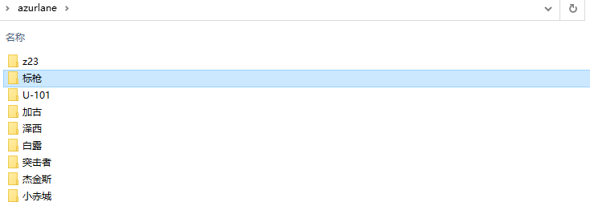
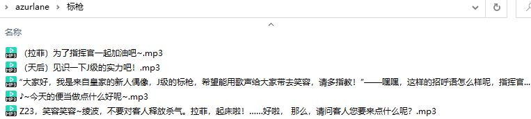

基于scrapy的小爬虫，爬取指定舰娘的语音并以语音中文名来命名。爬取数据均来自碧蓝航线wiki。
- [scrapy](https://scrapy.org/)
- [碧蓝航线wiki](https://wiki.biligame.com/blhx/%E9%A6%96%E9%A1%B5)

### Requirement
- scrapy
- six
- bs4

### Usage
克隆或解压后运行main.py

`ship_name`中，以列表输入想要爬取的舰船的名字或字符串`'all'`爬取全部舰船语音，支持输入和谐植动物园

`save_folder`是保存文件夹,程序将在`save_folder`中以`舰娘名字/语音翻译.mp3`来保存语音

`'all'`模式下会记录下载过的舰娘，可以多次分开运行。但不建议用此模式下载，全语音还是解包方便许多。这个项目也只是为了做mod方便看语音内容做的

